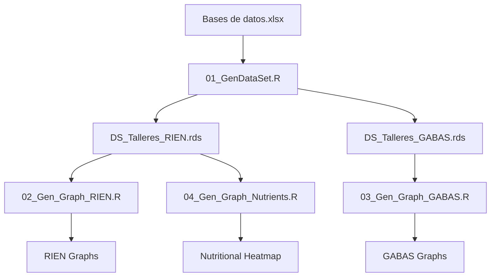

# Quantitative Analysis - Nutritional Benchmarking

This directory contains quantitative analysis scripts that compare ideal menus co-designed in participatory workshops with Colombian nutritional references.

## 📊 Analysis Flow

The analysis follows a sequential 4-step flow:



## 📁 Main Scripts

### 0. Required Libraries (`# Required libraries.r`)

Install and load necessary libraries:

```r
# Main libraries
library(tidyverse)      # Data manipulation and graphics
library(hrbrthemes)     # ggplot themes
library(readxl)         # Excel file reading
library(reshape2)       # Data reshaping
```

**Run first**: This script ensures all dependencies are available.

---

### 1. Dataset Generation (`01_GenDataSet.R`)

**Purpose**: Processes raw workshop data and generates structured datasets comparable with Colombian nutritional references.

**Input**:
- `Bases de datos.xlsx` - Raw workshop data ("Gramaje" sheet)
- GABAS equivalence table ("equiv_table_GABAS" sheet)
- RIEN references ("RIEN" sheet)
- GABAS references ("GABAS_Referencias" sheet)

**Process**:
1. Reads food weight data selected in workshops
2. Assigns each food to a GABAS group (Food-Based Dietary Guidelines)
3. Calculates total servings by region and age group
4. Compares with GABAS references (recommended servings)
5. Calculates nutritional adequacy vs RIEN (Recommended Intake of Energy and Nutrients)

**Output**:
- `DS_Talleres_GABAS.rds` / `.xlsx` - Dataset with servings by food group
- `DS_Talleres_RIEN.rds` / `.xlsx` - Dataset with nutritional adequacy

**Run**: 
```r
source("01_GenDataSet.R")
```

---

### 2. RIEN Visualization (`02_Gen_Graph_RIEN.R`)

**Purpose**: Generates nutritional adequacy graphs comparing co-designed menus with RIEN requirements.

**Input**:
- `DS_Talleres_RIEN.rds`

**Generated graphs**:
- `reg_Calorias.png` - Energy adequacy by region and age group
- `reg_Proteina.png` - Protein adequacy
- `reg_CHO.png` - Carbohydrate adequacy
- `reg_Grasas.png` - Fat adequacy
- `reg_Fibra.png` - Fiber adequacy
- `reg_Calcio.png` - Calcium adequacy
- `reg_Hierro.png` - Iron adequacy
- `reg_Sodio.png` - Sodium adequacy
- `ALL_Macronutrientes.png` - Macronutrient comparison (all groups)
- `ALL_Micronutrientes.png` - Micronutrient comparison (all groups)

**Interpretation**:
- **Green point**: Lower recommendation limit (EAR - Estimated Average Requirement)
- **Red point**: Upper recommendation limit (RDA - Recommended Dietary Allowance)
- **Black diamond**: Average value of co-designed menus
- **Gray line**: Adequacy range

**Run**:
```r
source("02_Gen_Graph_RIEN.R")
```

---

### 3. GABAS Visualization (`03_Gen_Graph_GABAS.R`)

**Purpose**: Generates graphs of servings by food group comparing with Colombian Food-Based Dietary Guidelines (GABAS).

**Input**:
- `DS_Talleres_GABAS.rds`

**GABAS food groups**:
1. Fruits
2. Vegetables
3. Cereals and tubers
4. Legumes
5. Animal-source proteins
6. Dairy
7. Fats and sugars

**Generated graphs**:
- `reg_GABAS.png` - Servings by food group by region
- `ALL_GABAS.png` - Aggregated comparison of all groups

**Interpretation**:
- Compares daily selected servings vs GABAS recommendations
- Identifies under-represented or over-represented food groups

**Run**:
```r
source("03_Gen_Graph_GABAS.R")
```

---

### 4. Nutritional Heatmap (`04_Gen_Graph_Nutrients.R`)

**Purpose**: Generates a nutritional adequacy heatmap by age group, visualizing the complete nutritional profile in an integrated way.

**Input**:
- `DS_Talleres_RIEN.rds`

**Generated graph**:
- `panel_b_heatmap.pdf` - Heatmap of % RIEN adequacy by nutrient and age group

**Color interpretation**:
- 🔴 **Dark red**: < 70% or > 130% (inadequacy)
- 🟡 **Yellow**: 70-90% or 110-130% (suboptimal)
- 🟢 **Green**: 90-110% (adequate)

**Nutrients analyzed**:
- Carbohydrates
- Proteins
- Fats
- Fiber
- Calcium
- Iron
- Sodium

**Run**:
```r
source("04_Gen_Graph_Nutrients.R")
```

---

## 🔄 Run Complete Analysis

To reproduce the entire analysis from scratch:

```r
# 1. Install required libraries
source("# Required libraries.r")

# 2. Generate datasets
source("01_GenDataSet.R")

# 3. Generate RIEN visualizations
source("02_Gen_Graph_RIEN.R")

# 4. Generate GABAS visualizations
source("03_Gen_Graph_GABAS.R")

# 5. Generate nutritional heatmap
source("04_Gen_Graph_Nutrients.R")
```

**Estimated time**: ~2-3 minutes

---

## 📂 Data Files

### Inputs

| File | Description |
|------|-------------|
| `Bases de datos.xlsx` | Primary workshop data with foods, servings, and nutritional composition |
| `Tabla de gramajes.xlsx` | Reference table for serving size estimation |

### Outputs

| File | Type | Description |
|------|------|-------------|
| `DS_Talleres_GABAS.rds` | RDS | Processed dataset with GABAS servings |
| `DS_Talleres_GABAS.xlsx` | Excel | Excel version of GABAS dataset |
| `DS_Talleres_RIEN.rds` | RDS | Processed dataset with RIEN adequacy |
| `DS_Talleres_RIEN.xlsx` | Excel | Excel version of RIEN dataset |

---

## 📈 Available Graphs

All graphs are saved in the `graphs/` folder:

### By Region and Age Group
- `reg_Calorias.png`
- `reg_Proteina.png`
- `reg_CHO.png`
- `reg_Grasas.png`
- `reg_Fibra.png`
- `reg_Calcio.png`
- `reg_Hierro.png`
- `reg_Sodio.png`
- `reg_GABAS.png`

### Aggregated
- `ALL_Macronutrientes.png`
- `ALL_Micronutrientes.png`
- `ALL_GABAS.png`
- `ALL_Otros.png`
- `panel_b_heatmap.pdf` (used in the article)

---

## 🔍 Nutritional References

### RIEN (Recommended Intake of Energy and Nutrients)

**Source**: Colombian Institute of Family Welfare (ICBF), 2015

- **Energy**: Healthy adult 70kg, light-moderate activity
- **Proteins**: 0.8-1.0 g/kg/day (EAR-RDA)
- **Carbohydrates**: 130-175 g/day (EAR-RDA)  
- **Fats**: 20-35% of total energy (AI)
- **Fiber**: 25-38 g/day (men-women average)
- **Calcium**: 800-1000 mg/day (EAR-RDA)
- **Iron**: 6-8 mg/day (EAR-RDA)
- **Sodium**: 1500 mg/day (AI - Adequate Intake)

### GABAS (Food-Based Dietary Guidelines)

**Source**: Colombian Ministry of Health and Social Protection, 2015

Daily serving recommendations by food group for Colombian adult population.

---

## 🛠️ System Requirements

- **R**: version 4.0 or higher
- **RStudio**: recommended for interactive execution
- **R libraries**: see `# Required libraries.r`

---

## 📝 Methodological Notes

1. **Servings**: Estimated using visual food models adapted from Nelson et al. (1997)
2. **Nutritional composition**: Colombian Food Composition Table (ICBF)
3. **Aggregation**: Averages by age group and region when multiple workshops
4. **Benchmarking**: Co-designed menus represent perceived ideals, **not habitual intake**

---

## ⚠️ Limitations

- Data represent **co-designed ideal menus**, not actually consumed diets
- Servings are **estimates** based on visual models
- Nutritional composition may vary according to local preparation
- Small sample size per subgroup (exploratory analysis)

---

## 📧 Contact

For technical questions about the analyses, contact:
- **Quantitative analysis**: Harold Cardona-Trujillo (hcardonat@eafit.edu.co) / Juan Carlos Muñoz-Mora (jmunozm1@eafit.edu.co)
- **Repository**: https://github.com/jcmunozmora/food-perception-rural-colombia

---

**Last updated**: February 2026
