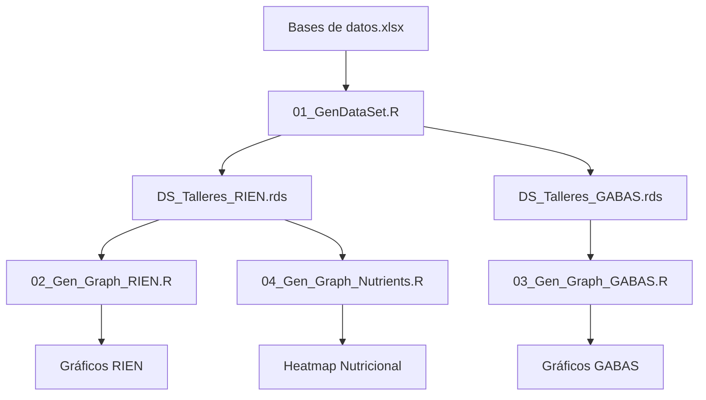

# Análisis Cuantitativo - Benchmarking Nutricional

Este directorio contiene los scripts de análisis cuantitativo que comparan los menús ideales co-diseñados en los talleres participativos con las referencias nutricionales colombianas.

## 📊 Flujo de Análisis

El análisis sigue un flujo secuencial de 4 pasos:



## 📁 Scripts Principales

### 0. Librerías Requeridas (`# Required libraries.r`)

Instalar y cargar las librerías necesarias:

```r
# Librerías principales
library(tidyverse)      # Manipulación de datos y gráficos
library(hrbrthemes)     # Temas para ggplot
library(readxl)         # Lectura de archivos Excel
library(reshape2)       # Reformateo de datos
```

**Ejecutar primero**: Este script asegura que todas las dependencias estén disponibles.

---

### 1. Generación de Datasets (`01_GenDataSet.R`)

**Propósito**: Procesa los datos crudos de los talleres y genera datasets estructurados comparables con las referencias nutricionales colombianas.

**Input**:
- `Bases de datos.xlsx` - Datos crudos de talleres (hoja "Gramaje")
- Tabla de equivalencias GABAS (hoja "equiv_table_GABAS")
- Referencias RIEN (hoja "RIEN")
- Referencias GABAS (hoja "GABAS_Referencias")

**Proceso**:
1. Lee datos de gramaje de alimentos seleccionados en talleres
2. Asigna cada alimento a un grupo GABA (Guías Alimentarias Basadas en Alimentos)
3. Calcula porciones totales por región y grupo etario
4. Compara con referencias GABAS (porciones recomendadas)
5. Calcula adecuación nutricional vs RIEN (Recomendaciones de Ingesta de Energía y Nutrientes)

**Output**:
- `DS_Talleres_GABAS.rds` / `.xlsx` - Dataset con porciones por grupo alimentario
- `DS_Talleres_RIEN.rds` / `.xlsx` - Dataset con adecuación nutricional

**Ejecutar**: 
```r
source("01_GenDataSet.R")
```

---

### 2. Visualización RIEN (`02_Gen_Graph_RIEN.R`)

**Propósito**: Genera gráficos de adecuación nutricional comparando los menús co-diseñados con los requerimientos RIEN.

**Input**:
- `DS_Talleres_RIEN.rds`

**Gráficos generados**:
- `reg_Calorias.png` - Adecuación energética por región y grupo etario
- `reg_Proteina.png` - Adecuación de proteínas
- `reg_CHO.png` - Adecuación de carbohidratos
- `reg_Grasas.png` - Adecuación de grasas
- `reg_Fibra.png` - Adecuación de fibra
- `reg_Calcio.png` - Adecuación de calcio
- `reg_Hierro.png` - Adecuación de hierro
- `reg_Sodio.png` - Adecuación de sodio
- `ALL_Macronutrientes.png` - Comparación macronutrientes (todos los grupos)
- `ALL_Micronutrientes.png` - Comparación micronutrientes (todos los grupos)

**Interpretación**:
- **Punto verde**: Límite inferior de recomendación (EAR - Estimated Average Requirement)
- **Punto rojo**: Límite superior de recomendación (RDA - Recommended Dietary Allowance)
- **Rombo negro**: Valor promedio de menús co-diseñados
- **Línea gris**: Rango de adecuación

**Ejecutar**:
```r
source("02_Gen_Graph_RIEN.R")
```

---

### 3. Visualización GABAS (`03_Gen_Graph_GABAS.R`)

**Propósito**: Genera gráficos de porciones por grupo alimentario comparando con las Guías Alimentarias Basadas en Alimentos de Colombia (GABAS).

**Input**:
- `DS_Talleres_GABAS.rds`

**Grupos alimentarios GABAS**:
1. Frutas
2. Verduras y hortalizas
3. Cereales y tubérculos
4. Leguminosas
5. Proteínas de origen animal
6. Lácteos
7. Grasas y azúcares

**Gráficos generados**:
- `reg_GABAS.png` - Porciones por grupo alimentario por región
- `ALL_GABAS.png` - Comparación agregada de todos los grupos

**Interpretación**:
- Compara porciones diarias seleccionadas vs recomendaciones GABAS
- Identifica grupos alimentarios sub-representados o sobre-representados

**Ejecutar**:
```r
source("03_Gen_Graph_GABAS.R")
```

---

### 4. Heatmap Nutricional (`04_Gen_Graph_Nutrients.R`)

**Propósito**: Genera un heatmap de adecuación nutricional por grupo etario, visualizando el perfil nutricional completo de forma integrada.

**Input**:
- `DS_Talleres_RIEN.rds`

**Gráfico generado**:
- `panel_b_heatmap.pdf` - Heatmap de % adecuación RIEN por nutriente y grupo etario

**Interpretación de colores**:
- 🔴 **Rojo oscuro**: < 70% o > 130% (inadecuación)
- 🟡 **Amarillo**: 70-90% o 110-130% (subóptimo)
- 🟢 **Verde**: 90-110% (adecuado)

**Nutrientes analizados**:
- Carbohidratos
- Proteínas
- Grasas
- Fibra
- Calcio
- Hierro
- Sodio

**Ejecutar**:
```r
source("04_Gen_Graph_Nutrients.R")
```

---

## 🔄 Ejecutar Análisis Completo

Para reproducir todo el análisis desde cero:

```r
# 1. Instalar librerías necesarias
source("# Required libraries.r")

# 2. Generar datasets
source("01_GenDataSet.R")

# 3. Generar visualizaciones RIEN
source("02_Gen_Graph_RIEN.R")

# 4. Generar visualizaciones GABAS
source("03_Gen_Graph_GABAS.R")

# 5. Generar heatmap nutricional
source("04_Gen_Graph_Nutrients.R")
```

**Tiempo estimado**: ~2-3 minutos

---

## 📂 Archivos de Datos

### Inputs

| Archivo | Descripción |
|---------|-------------|
| `Bases de datos.xlsx` | Datos primarios de talleres con alimentos, porciones y composición nutricional |
| `Tabla de gramajes.xlsx` | Tabla de referencia para estimación de porciones |

### Outputs

| Archivo | Tipo | Descripción |
|---------|------|-------------|
| `DS_Talleres_GABAS.rds` | RDS | Dataset procesado con porciones GABAS |
| `DS_Talleres_GABAS.xlsx` | Excel | Versión Excel del dataset GABAS |
| `DS_Talleres_RIEN.rds` | RDS | Dataset procesado con adecuación RIEN |
| `DS_Talleres_RIEN.xlsx` | Excel | Versión Excel del dataset RIEN |

---

## 📈 Gráficos Disponibles

Todos los gráficos se guardan en la carpeta `graphs/`:

### Por Región y Grupo Etario
- `reg_Calorias.png`
- `reg_Proteina.png`
- `reg_CHO.png`
- `reg_Grasas.png`
- `reg_Fibra.png`
- `reg_Calcio.png`
- `reg_Hierro.png`
- `reg_Sodio.png`
- `reg_GABAS.png`

### Agregados
- `ALL_Macronutrientes.png`
- `ALL_Micronutrientes.png`
- `ALL_GABAS.png`
- `ALL_Otros.png`
- `panel_b_heatmap.pdf` (usado en el artículo)

---

## 🔍 Referencias Nutricionales

### RIEN (Recomendaciones de Ingesta de Energía y Nutrientes)

**Fuente**: Instituto Colombiano de Bienestar Familiar (ICBF), 2015

- **Energía**: Adulto sano 70kg, actividad ligera-moderada
- **Proteínas**: 0.8-1.0 g/kg/día (EAR-RDA)
- **Carbohidratos**: 130-175 g/día (EAR-RDA)  
- **Grasas**: 20-35% de energía total (AI)
- **Fibra**: 25-38 g/día (promedio hombres-mujeres)
- **Calcio**: 800-1000 mg/día (EAR-RDA)
- **Hierro**: 6-8 mg/día (EAR-RDA)
- **Sodio**: 1500 mg/día (AI - Adequate Intake)

### GABAS (Guías Alimentarias Basadas en Alimentos)

**Fuente**: Ministerio de Salud y Protección Social de Colombia, 2015

Recomendaciones de porciones diarias por grupo alimentario para población adulta colombiana.

---

## 🛠️ Requisitos del Sistema

- **R**: versión 4.0 o superior
- **RStudio**: recomendado para ejecución interactiva
- **Librerías R**: ver `# Required libraries.r`

---

## 📝 Notas Metodológicas

1. **Porciones**: Estimadas usando modelos visuales de alimentos adaptados de Nelson et al. (1997)
2. **Composición nutricional**: Tabla de Composición de Alimentos Colombianos (ICBF)
3. **Agregación**: Promedios por grupo etario y región cuando múltiples talleres
4. **Benchmarking**: Los menús co-diseñados representan ideales percibidos, **no ingesta habitual**

---

## ⚠️ Limitaciones

- Los datos representan **menús ideales co-diseñados**, no dietas reales consumidas
- Las porciones son **estimaciones** basadas en modelos visuales
- La composición nutricional puede variar según preparación local
- Pequeño tamaño muestral por subgrupo (análisis exploratorio)

---

## 📧 Contacto

Para preguntas técnicas sobre los análisis, contactar:
- **Análisis cuantitativo**: Harold Cardona-Trujillo (hcardonat@eafit.edu.co) / Juan Carlos Muñoz-Mora (jmunozm1@eafit.edu.co)
- **Repositorio**: https://github.com/jcmunozmora/food-perception-rural-colombia

---

**Última actualización**: Febrero 2026
