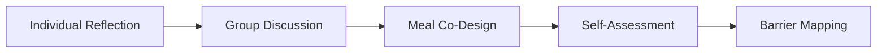
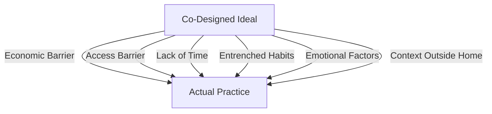
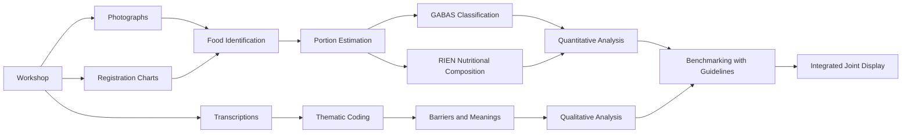

# 🎨 Participatory Co-Design Workshops

## Executive Summary

This document presents a complete visual description of the **participatory co-design workshops** conducted as part of the **"Healthy is fresh"** study in three rural subregions of Antioquia, Colombia.

---

## 📍 Study Context

### Locations

Workshops were conducted in three rural municipalities of Antioquia:

1. **Medellín** (peri-urban rural zone)
2. **Guarne** (rural)
3. **Santa Rosa de Osos** (rural)

### Participants

- **Total:** 41 adults (18-70 years)
- **Distribution:** 21 women, 20 men
- **Age groups:** 18-30 years, 31-50 years, +50 years
- **Profile:** Members of rural cooperatives with diversity in education and occupation

---

## 🎯 Workshop Objectives

1. **Elicit local meanings** of "healthy eating"
2. **Co-design ideal menus** using visual food models
3. **Identify gaps** between ideal and habitual diet
4. **Map barriers** that limit healthy food choices

---

## 📋 Participatory Methodology

### Co-Design Approach

Workshops used a **participatory approach** where participants are not passive subjects, but **active co-creators** of knowledge about healthy eating in their rural context.



### Tools Used

- 🍽️ **Visual food models** (adapted from Nelson et al., 1997)
- 📝 **Individual reflection** templates
- 📋 **Collaborative recording** charts
- 📸 **Photographic documentation** of co-designed meals
- 🎙️ **Audio recordings** (with consent)

---

## 📊 Workshop Structure (2 hours)

### Phase 1: Welcome and Consent (10 min)

- Team and objectives presentation
- Confidentiality explanation
- Informed consent signature
- Brief sociodemographic questionnaire

---

### Phase 2: Individual Reflection (15 min)

#### Materials Used

📄 **Individual Reflection Template**


Participants answered questions like:
- *"What do you consider a healthy breakfast?"*
- *"What should a healthy lunch include?"*
- *"What should a healthy dinner contain?"*

**Purpose:** Capture initial ideas without group influence, allowing personal concepts of "healthy" to emerge.

---

### Phase 3: Share Group Reflections (10 min)

Each participant shared their ideas with the group, identifying:
- ✅ **Consensus:** Foods everyone considers healthy
- 🤔 **Divergences:** Foods with mixed opinions
- 💡 **Surprises:** Unexpected or innovative ideas

---

### Phase 4: Ideal Menu Co-Design (40 min)

#### The Co-Design Process

**Materials:**
- Visual food models (food replicas)
- Food cards with photos
- Portion tokens

**Activity:**
Groups built **ideal meals** for:
1. Breakfast
2. Mid-morning snack
3. Lunch
4. Afternoon snack
5. Dinner

#### Visual Examples of Co-Designed Meals

##### 🍳 Healthy Breakfast - Medellín, Group 2 (31-50 years)


**Selected components:**
- Eggs (protein)
- Arepa (cereal)
- Fruits (plantain, papaya)
- Hot beverage (coffee with milk or light panela water)

**Group reflection:** *"Breakfast should be complete and energetic, but without excess fat. Arepa is cultural, it cannot be eliminated."*

---

##### 🍲 Healthy Lunch - Medellín, Group 2 (31-50 years)


**Selected components:**
- Protein (chicken, fish or lean meat)
- Rice or potato (moderate portion)
- Salad (lettuce, tomato)
- Legumes (beans)
- Natural juice or water

**Group reflection:** *"Lunch should include everything, but in small portions. Protein and beans are essential."*

---

##### 🥗 Healthy Dinner - Medellín, Group 2 (31-50 years)


**Selected components:**
- Soup or broth
- Light protein (egg, cheese)
- Small arepa or whole wheat bread
- Infusion (herbal tea)

**Group reflection:** *"Dinner should be light to not go to bed 'full'. We prefer soups or something warm."*

---

##### 🍎 Snacks - Medellín, Group 2 (31-50 years)


**Selected components:**
- Fresh fruits (banana, apple, papaya)
- Nuts (peanuts, almonds) - in small quantities
- Yogurt (low sugar)

**Group reflection:** *"Snacks should satisfy hunger between meals without 'filling'. Fruits are best, but sometimes there's no time."*

---

##### 🥘 Comparison Between Age Groups

###### Breakfast - Medellín, Group 3 (+50 years)


**Observations:**
- Greater emphasis on traditional preparations
- Less protein variety (egg as base)
- Preference for traditional hot beverages (panela water, coffee)

---

###### Lunch - Medellín, Group 3 (+50 years)


**Observations:**
- More "complete" plate in the traditional sense
- Larger carbohydrate portion (rice, potato, plantain)
- Consistent presence of protein and legumes

---

###### Dinner - Medellín, Group 3 (+50 years)


**Observations:**
- More substantial meal than younger groups
- Less distinction between lunch and dinner
- Preference for "hot food" vs. light options

---

### Phase 5: Registration and Documentation (During Phase 4)

#### Registration Chart

📋 **Meal Registration Format**


For each co-designed meal, the following was recorded:
- ✅ Selected foods
- ✅ Approximate portions (using visual models)
- ✅ Corresponding GABAS food group
- ✅ Group observations and comments

#### Standardized Photographs

Each meal was photographed following a protocol:
- 📸 Overhead view (from above)
- 📸 Good lighting
- 📸 Visible label with region, age group, and meal time
- 📸 No participant faces (to protect privacy)

---

### Phase 6: Alignment Assessment (15 min)

#### Alignment Scale (1-5)

Participants rated **how close** their habitual diet is to the ideal menu they co-designed:

```
1.0 = Very far (almost never eat like this)
2.0 = Quite far
3.0 = Moderately close (sometimes)
4.0 = Quite close (frequently)
5.0 = Totally aligned (eat like this every day)
```

#### Aggregated Results

**Rating distribution:**
- **Minimum:** 1.5
- **Average:** 2.5-3.5
- **Maximum:** 4.5

**Interpretation:** Significant gap between co-designed ideal and actual practice.

> *"I know how I should eat, but I can't always do it."* - Participant, Guarne

---

### Phase 7: Barrier Discussion (25 min)

#### Central Question

*"What prevents you from reaching 5.0? What makes it difficult to eat like the ideal we designed?"*

#### Identified Barrier Categories

##### 💰 1. Economic
- *"Eating healthy is very expensive"*
- *"Whole grain or sugar-free products cost double"*
- *"One has to prioritize: food or medicine"*

##### 🛒 2. Access and Availability
- *"In town there's no variety of vegetables"*
- *"When fresh vegetables arrive they're already spoiled"*
- *"You have to go to the city to get variety"*

##### ⏰ 3. Time
- *"I come home tired from work and the easiest thing is to fry something"*
- *"Cooking healthy requires more time"*
- *"Weekends are when you most 'deviate from the plan'"*

##### 🍟 4. Preferences and Habits
- *"Everything tastes better fried"*
- *"My kids don't eat salad"*
- *"We've been eating like this for years"*

##### 😰 5. Emotional
- *"When I'm stressed I eat more sweets"*
- *"Anxiety makes me snack between meals"*
- *"On Sundays I reward myself with 'forbidden' food"*

##### 🤷 6. Knowledge/Uncertainty
- *"I don't really know what the correct portions are"*
- *"I don't understand nutrition labels well"*
- *"I don't know how to cook some vegetables"*

---

### Phase 8: Closure and Reflection (5 min)

- Thank participants
- Summary of key group learnings
- Explanation of next steps (analysis and dissemination)
- Contact for questions or follow-up

---

## 📊 Workshop Products

### 1. Qualitative Data

✅ **Complete transcriptions** of discussions (restricted for ethical reasons)  
✅ **Field notes** from facilitators  
✅ **Thematic codes** of barriers and meanings  

See: [Analysis_Qualitative/](Analysis_Qualitative/README.md)

---

### 2. Quantitative Data

✅ **Food portions** selected in ideal menus  
✅ **Classification by GABAS groups** (Dietary Guidelines)  
✅ **Estimated nutritional composition** (RIEN)  
✅ **Alignment scales** (1-5)

See: [Analysis_Quantitative/](Analysis_Quantitative/README.md)

---

### 3. Visual Evidence

✅ **200+ photographs** of co-designed meals  
✅ **Organized** by region and age group  
✅ **Visual documentation** of the process

See: [Pictures/](Participatory_Workshop_Evidence-Transcriptions/Pictures/)

---

## 🔍 Key Workshop Findings

### Meanings of "Healthy"

Participants defined "healthy" primarily as:

1. **"Fresh"** - Unprocessed, freshly prepared
2. **"Home-made"** - Prepared at home, not store-bought
3. **"Natural"** - Without chemicals or preservatives
4. **"Balanced"** - "A bit of everything" (diffuse concept)
5. **"Prevent diseases"** - Association with long-term health

> **Important note:** They rarely mentioned specific nutrients (proteins, vitamins, etc.). Meanings are **cultural and experiential**, not technical-scientific.

---

### Patterns in Ideal Menus

#### ✅ Consistently Included Foods:
- **Eggs** - In almost all breakfasts
- **Legumes** - Beans especially
- **Rice** - Although portion is debated
- **Plantain** - Both as side dish and fruit
- **Chicken/Meat** - Preferred animal protein

#### ⚠️ Under-Represented Foods:
- **Vegetables** - Limited to simple salad (lettuce, tomato)
- **Dairy** - Especially in older groups
- **Fish** - Little presence (limited access)
- **Fruit variety** - Repeat banana, papaya, orange

#### ❌ Foods Excluded from "Ideal":
- Soft drinks
- Ultra-processed snacks (chips, sweet cookies)
- Processed meats
- Fast food (hamburgers, pizza)

> **Paradox:** Although excluded from the ideal, in the barrier discussion participants admit to consuming them frequently in practice.

---

### The Ideal-Practice Gap

**Average alignment: 2.8 / 5.0**

#### Factors that Widen the Gap:



#### Specific Contexts:

- **Better alignment:** At home, weekends, with planning
- **Worse alignment:** Away from home, during work, weekends (paradox), under stress

---

## 🎓 Methodological Lessons Learned

### What Worked Well ✅

1. **Visual models:** Facilitated communication about portions
2. **Group co-design:** Generated rich discussions and negotiations
3. **Separate age groups:** Allowed generational differences to emerge
4. **Photographs:** Objective documentation complementary to transcriptions
5. **Trained facilitators:** Essential to maintain neutrality

### Challenges Faced ⚠️

1. **Social desirability:** Some participants wanted to "answer correctly"
2. **Limited time:** 2 hours were just enough, some groups wanted more time
3. **Literacy:** Variability in writing ability (individual phase)
4. **Interruptions:** Logistics in rural communities (calls, noise)
5. **Expectations:** Some expected "recipes" or direct nutritional advice

### Recommendations for Replication 💡

- ✅ Pilot materials locally
- ✅ Adapt foods to regional contexts
- ✅ Train facilitators in participatory techniques
- ✅ Prepare logistical contingencies
- ✅ Manage expectations from the start
- ✅ Include snacks (appropriate to the theme)
- ✅ Respect local time (not "urban time")

---

## 📥 Downloadable Materials

### Workshop Forms

| Material | Description | Link |
|----------|-------------|------|
| **Reflection Templates** | Breakfast, lunch, dinner, barriers | [PDF](Participatory_Workshop_Forms/desayuno,%20almuerzo,%20comida,%20barreras.pdf) |
| **Registration Chart** | To document co-designed meals | [PDF](Participatory_Workshop_Forms/Cuadro%20registro.pdf) |
| **Extra Materials** | Scales, discussion questions | [PDF](Participatory_Workshop_Forms/extras.pdf) |

### Methodological Guides

| Material | Description | Folder |
|----------|-------------|--------|
| **Workshop Design** | Methodological notes and protocol | [View folder](Participatory_Workshops_Design/) |
| **Visual Evidence** | 200+ photos of co-designed meals | [View folder](Participatory_Workshop_Evidence-Transcriptions/Pictures/) |

---

## 📸 Evidence Gallery

### By Region

#### 1. Medellín (Peri-urban Rural)
- [Group 1 (19-30 years)](Participatory_Workshop_Evidence-Transcriptions/Pictures/1.%20Medellín/Grupo%201%20-%2019%20a%2030%20años/)
- [Group 2 (31-50 years)](Participatory_Workshop_Evidence-Transcriptions/Pictures/1.%20Medellín/Grupo%202%20-%2031%20a%2050%20años/)
- [Group 3 (+50 years)](Participatory_Workshop_Evidence-Transcriptions/Pictures/1.%20Medellín/Grupo%203%20-%20%2B50%20años/)

#### 2. Guarne (Rural)
- [Group 1 (19-30 years)](Participatory_Workshop_Evidence-Transcriptions/Pictures/2.%20Guarne/Grupo%201%20-%2019%20-%2030%20años/)
- [Group 2 (31-50 years)](Participatory_Workshop_Evidence-Transcriptions/Pictures/2.%20Guarne/Grupo%202%20-%2031%20-%2050%20años/)
- [Group 3 (+50 years)](Participatory_Workshop_Evidence-Transcriptions/Pictures/2.%20Guarne/Grupo%203%20-%20%2B50%20años/)

#### 3. Santa Rosa de Osos (Rural)
- [Group 1 (19-30)](Participatory_Workshop_Evidence-Transcriptions/Pictures/3.%20Santa%20Rosa%20de%20Osos/Grupo%201%20-%2019%20a%2030/)
- [Group 2 (30-50)](Participatory_Workshop_Evidence-Transcriptions/Pictures/3.%20Santa%20Rosa%20de%20Osos/Grupo%202%20-%2030%20a%2050/)
- [Group 3 (+50)](Participatory_Workshop_Evidence-Transcriptions/Pictures/3.%20Santa%20Rosa%20de%20Osos/Grupo%203%20-%20%2B50/)

---

## 🔬 From Workshop to Analysis

### Data Flow



### Analyses Performed

#### Quantitative:
- ✅ Comparison with **GABAS** (food groups)
- ✅ Comparison with **RIEN** (nutritional adequacy)
- ✅ Heatmaps by age group
- ✅ Divergence graphs

View results: [Analysis_Quantitative/graphs/](Analysis_Quantitative/graphs/)

#### Qualitative:
- ✅ Thematic analysis of **meanings**
- ✅ Coding of **barriers** (6 categories)
- ✅ Analysis of **ideal-practice gap**
- ✅ Patterns by age group

View results: [Analysis_Qualitative/](Analysis_Qualitative/README.md)

#### Mixed Integration:
- ✅ **Joint display** aligning themes with benchmarking
- ✅ Interpretation of nutritional divergences through barriers
- ✅ Identification of intervention targets

See integration in: Main article (Table 1, Joint Display)

---

## 🌍 Implications for Interventions

### Key Insights for Policy Design

#### 1. **Beyond nutrition education**
Participants have clear ideas of "healthy," but **structural barriers** (cost, access, time) are more determinant than knowledge.

> **Recommendation:** Interventions should address access and affordability, not just "information."

---

#### 2. **Respect local heuristics**
"Fresh" and "home-made" are **culturally powerful anchors**. Interventions can leverage them.

> **Recommendation:** Frame messages around "fresh" and "home-made," not just technical nutrients.

---

#### 3. **Context matters**
Alignment is **situation-dependent** (better at home, worse outside).

> **Recommendation:** Context-specific interventions for work settings, community cafeterias, etc.

---

#### 4. **Underestimated emotional factors**
"Emotional eating" is an important but **underrecognized** barrier.

> **Recommendation:** Interventions should include stress/anxiety management components.

---

#### 5. **Age diversity**
Different groups prioritize different values (tradition vs. restriction/control).

> **Recommendation:** Age-segmented messages, not "one size fits all."

---

## 📚 Publications and Dissemination

### Main Article

**Arcila-Agudelo, A.M., Cardona-Trujillo, H., Herazo-Castelblanco, A.S., Mejía-Gil, M.C., Muñoz-Mora, J.C., & Ortiz-Pradilla, T. (2026).** *"Healthy is fresh": A participatory study of meal ideals and barriers shaping food choice in rural Colombia.* [Journal Name].

📄 [View PDF article](Arcila_etat_2026.pdf)

---

### Supplementary Materials (This Repository)

🌐 **Website:** https://jcmunozmora.github.io/food-perception-rural-colombia

📦 **GitHub Repository:** https://github.com/jcmunozmora/food-perception-rural-colombia

📋 **Includes:**
- Reusable forms
- Reproducible analysis scripts
- Anonymized data
- Visual evidence
- Methodological guides

---

## 📧 Contact and Inquiries

### About the Workshop and Participatory Methodology:

**María Claudia Mejía-Gil**  
📧 mmejiagi@eafit.edu.co  
*Workshop coordination and design*

**Tatiana Ortiz-Pradilla**  
📧 tortizpr@eafit.edu.co  
*Facilitation and qualitative analysis*

---

### About Data and Evidence:

**Ana María Arcila-Agudelo** (Corresponding Author)  
📧 ana.arcila@uniremington.edu.co  
*Overall study coordination*

**Ana Sofia Herazo-Castelblanco**  
📧 asherazoc@eafit.edu.co  
*Transcriptions and fieldwork*

---

### To Replicate the Workshop in Another Context:

All materials are available under **CC BY 4.0** license. You can:
- ✅ Download and adapt forms
- ✅ Use the methodology (with appropriate citation)
- ✅ Request advice for adaptation

**Contact for advice:** mmejiagi@eafit.edu.co / ana.arcila@uniremington.edu.co

---

## ⚖️ Ethical Aspects

### Ethical Approval

- **Committee:** Research Ethics Committee, Universidad EAFIT
- **Protocol:** Comité de Ética-2022-07
- **Approval:** September 5, 2022

### Participant Protection

✅ Informed consent from all participants  
✅ Photographs without identifiable faces  
✅ Anonymized transcriptions (names and places removed)  
✅ Aggregated data to protect identity in small communities  
✅ Restricted audio recordings (not public)  

### Access to Sensitive Data

Complete transcriptions available **upon request** and ethical approval for:
- Researchers with approved protocols
- Legitimate academic purposes
- With confidentiality guarantees

**Requests:** ana.arcila@uniremington.edu.co

---

## 🙏 Acknowledgments

This work would not have been possible without:

- **The 41 participants** who generously shared their time, experiences, and knowledge
- **Community leaders** and cooperative coordinators in Medellín, Guarne, and Santa Rosa de Osos
- **Facilitators and assistants** who conducted workshops with sensitivity and professionalism
- **FAO Colombia** for technical and methodological support
- **Universidad EAFIT and Corporación Universitaria Remington** for institutional support

---

## 📖 How to Cite

### The Workshop:

```bibtex
@misc{arcila-agudelo2026workshop,
  author = {Arcila-Agudelo, Ana María and Mejía-Gil, María Claudia and 
            Ortiz-Pradilla, Tatiana and Herazo-Castelblanco, Ana Sofia},
  title = {Participatory Co-Design Workshops: Methodology and Materials},
  year = {2026},
  howpublished = {GitHub repository},
  url = {https://github.com/jcmunozmora/food-perception-rural-colombia/blob/main/WORKSHOP.md}
}
```

### The Complete Study:

```bibtex
@article{arcila-agudelo2026healthy,
  title={"Healthy is fresh": A participatory study of meal ideals and 
         barriers shaping food choice in rural Colombia},
  author={Arcila-Agudelo, Ana María and Cardona-Trujillo, Harold and 
          Herazo-Castelblanco, Ana Sofia and Mejía-Gil, María Claudia and 
          Muñoz-Mora, Juan Carlos and Ortiz-Pradilla, Tatiana},
  journal={[Journal Name]},
  year={2026}
}
```

---

## 🔗 Useful Links

- 🏠 [Repository main page](README.md)
- 🚀 [Quick start guide](QUICKSTART.md)
- 📊 [Quantitative analysis](Analysis_Quantitative/README.md)
- 📝 [Qualitative analysis](Analysis_Qualitative/README.md)
- 👥 [Author information](AUTHORS.md)
- ⚖️ [CC BY 4.0 License](LICENSE.md)
- 📋 [Downloadable forms](Participatory_Workshop_Forms/)
- 📸 [Photo gallery](Participatory_Workshop_Evidence-Transcriptions/Pictures/)

---

**Last updated:** February 14, 2026

---

*This document is part of the supplementary materials of the "Healthy is fresh" study and is available under Creative Commons Attribution 4.0 International License (CC BY 4.0).*
