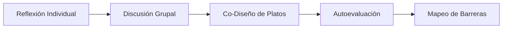
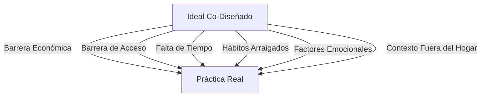
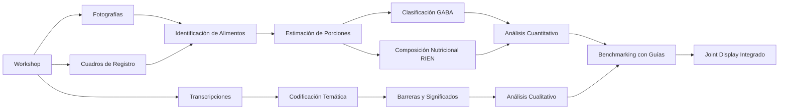

# 🎨 Talleres Participativos de Co-Diseño

## Resumen Ejecutivo

Este documento presenta una descripción visual completa de los **talleres participativos de co-diseño** realizados como parte del estudio **"Healthy is fresh"** en tres subregiones rurales de Antioquia, Colombia.

---

## 📍 Contexto del Estudio

### Ubicaciones

Los talleres se realizaron en tres municipios rurales de Antioquia:

1. **Medellín** (zona periurbana rural)
2. **Guarne** (rural)
3. **Santa Rosa de Osos** (rural)

### Participantes

- **Total:** 41 adultos (18-70 años)
- **Distribución:** 21 mujeres, 20 hombres
- **Grupos etarios:** 18-30 años, 31-50 años, +50 años
- **Perfil:** Miembros de cooperativas rurales con diversidad en educación y ocupación

---

## 🎯 Objetivos de los Talleres

1. **Elicitar significados locales** de "alimentación saludable"
2. **Co-diseñar menús ideales** usando modelos visuales de alimentos
3. **Identificar brechas** entre dieta ideal y dieta habitual
4. **Mapear barreras** que limitan elecciones alimentarias saludables

---

## 📋 Metodología Participativa

### Enfoque de Co-Diseño

Los talleres utilizaron un **enfoque participativo** donde los participantes no son sujetos pasivos, sino **co-creadores activos** del conocimiento sobre alimentación saludable en su contexto rural.



### Herramientas Utilizadas

- 🍽️ **Modelos visuales de alimentos** (adaptados de Nelson et al., 1997)
- 📝 **Plantillas de reflexión** individual
- 📋 **Cuadros de registro** colaborativo
- 📸 **Documentación fotográfica** de platos co-diseñados
- 🎙️ **Grabaciones de audio** (con consentimiento)

---

## 📊 Estructura de los Talleres (2 horas)

### Fase 1: Bienvenida y Consentimiento (10 min)

- Presentación del equipo y objetivos
- Explicación de confidencialidad
- Firma de consentimiento informado
- Cuestionario sociodemográfico breve

---

### Fase 2: Reflexión Individual (15 min)

#### Materiales Utilizados

📄 **Plantilla de Reflexión Individual**


Los participantes respondieron preguntas como:
- *"¿Qué consideras un desayuno saludable?"*
- *"¿Qué debería incluir un almuerzo saludable?"*
- *"¿Qué debería contener una cena saludable?"*

**Propósito:** Capturar ideas iniciales sin influencia grupal, permitiendo que emergieran conceptos personales de "saludable."

---

### Fase 3: Compartir Reflexiones Grupales (10 min)

Cada participante compartió sus ideas con el grupo, identificando:
- ✅ **Consensos:** Alimentos que todos consideran saludables
- 🤔 **Divergencias:** Alimentos con opiniones mixtas
- 💡 **Sorpresas:** Ideas inesperadas o innovadoras

---

### Fase 4: Co-Diseño de Menú Ideal (40 min)

#### El Proceso de Co-Diseño

**Materiales:**
- Modelos visuales de alimentos (réplicas de comida)
- Tarjetas de alimentos con fotos
- Fichas de porciones

**Actividad:**
Los grupos construyeron **platos ideales** para:
1. Desayuno
2. Media mañana
3. Almuerzo
4. Merienda
5. Cena

#### Ejemplos Visuales de Platos Co-Diseñados

##### 🍳 Desayuno Saludable - Medellín, Grupo 2 (31-50 años)


**Componentes seleccionados:**
- Huevos (proteína)
- Arepa (cereal)
- Frutas (plátano, papaya)
- Bebida caliente (café con leche o agua de panela light)

**Reflexión del grupo:** *"El desayuno debe ser completo y energético, pero sin exceso de grasa. La arepa es cultural, no se puede eliminar."*

---

##### 🍲 Almuerzo Saludable - Medellín, Grupo 2 (31-50 años)


**Componentes seleccionados:**
- Proteína (pollo, pescado o carne magra)
- Arroz o papa (porción moderada)
- Ensalada (lechuga, tomate)
- Leguminosas (frijoles)
- Jugo natural o agua

**Reflexión del grupo:** *"El almuerzo debe incluir de todo, pero en porciones pequeñas. La proteína y los frijoles son esenciales."*

---

##### 🥗 Cena Saludable - Medellín, Grupo 2 (31-50 años)


**Componentes seleccionados:**
- Sopa o caldo
- Proteína ligera (huevo, queso)
- Arepa pequeña o pan integral
- Infusión (aromática)

**Reflexión del grupo:** *"La cena debe ser liviana para no acostarse 'lleno'. Preferimos sopas o algo caliente."*

---

##### 🍎 Snacks y Meriendas - Medellín, Grupo 2 (31-50 años)


**Componentes seleccionados:**
- Frutas frescas (banano, manzana, papaya)
- Frutos secos (maní, almendras) - en pequeñas cantidades
- Yogur (bajo en azúcar)

**Reflexión del grupo:** *"Los snacks deben calmar el hambre entre comidas sin 'llenar'. Las frutas son lo mejor, pero a veces no hay tiempo."*

---

##### 🥘 Comparación entre Grupos Etarios

###### Desayuno - Medellín, Grupo 3 (+50 años)


**Observaciones:**
- Mayor énfasis en preparaciones tradicionales
- Menos variedad de proteínas (huevo como base)
- Preferencia por bebidas calientes tradicionales (agua de panela, café)

---

###### Almuerzo - Medellín, Grupo 3 (+50 años)


**Observaciones:**
- Plato más "completo" en el sentido tradicional
- Mayor porción de carbohidratos (arroz, papa, plátano)
- Presencia consistente de proteína y leguminosas

---

###### Cena - Medellín, Grupo 3 (+50 años)


**Observaciones:**
- Comida más sustancial que grupos más jóvenes
- Menor distinción entre almuerzo y cena
- Preferencia por "comida caliente" vs. opciones ligeras

---

### Fase 5: Registro y Documentación (Durante Fase 4)

#### Cuadro de Registro

📋 **Formato de Registro de Platos**


Para cada plato co-diseñado, se registró:
- ✅ Alimentos seleccionados
- ✅ Porciones aproximadas (usando modelos visuales)
- ✅ Grupo alimentario GABA correspondiente
- ✅ Observaciones y comentarios del grupo

#### Fotografías Estandarizadas

Cada plato fue fotografiado siguiendo un protocolo:
- 📸 Vista cenital (desde arriba)
- 📸 Buena iluminación
- 📸 Etiqueta visible con región, grupo etario y momento del día
- 📸 Sin rostros de participantes (para proteger privacidad)

---

### Fase 6: Evaluación de Alineación (15 min)

#### Escala de Alineación (1-5)

Los participantes calificaron **qué tan cerca** está su dieta habitual del menú ideal que co-diseñaron:

```
1.0 = Muy lejos (casi nunca como así)
2.0 = Bastante lejos
3.0 = Medianamente cerca (a veces)
4.0 = Bastante cerca (frecuentemente)
5.0 = Totalmente alineado (como así todos los días)
```

#### Resultados Agregados

**Distribución de calificaciones:**
- **Mínimo:** 1.5
- **Promedio:** 2.5-3.5
- **Máximo:** 4.5

**Interpretación:** Brecha significativa entre el ideal co-diseñado y la práctica real.

> *"Yo sé cómo debería comer, pero no siempre puedo."* - Participante, Guarne

---

### Fase 7: Discusión de Barreras (25 min)

#### Pregunta Central

*"¿Qué le impide alcanzar 5.0? ¿Qué dificulta comer como el ideal que diseñamos?"*

#### Categorías de Barreras Identificadas

##### 💰 1. Económicas
- *"Comer saludable es muy caro"*
- *"Los productos integrales o sin azúcar cuestan el doble"*
- *"Uno tiene que priorizar: comida o medicinas"*

##### 🛒 2. Acceso y Disponibilidad
- *"En el pueblo no hay variedad de verduras"*
- *"Cuando llega la verdura fresca ya está dañada"*
- *"Hay que ir a la ciudad para conseguir variedad"*

##### ⏰ 3. Tiempo
- *"Llego cansado del trabajo y lo más fácil es freír algo"*
- *"Cocinar saludable requiere más tiempo"*
- *"Los fines de semana es cuando más se 'sale del plan'"*

##### 🍟 4. Preferencias y Hábitos
- *"Todo sabe mejor frito"*
- *"Mis hijos no comen ensalada"*
- *"Estamos acostumbrados a comer así desde hace años"*

##### 😰 5. Emocionales
- *"Cuando estoy estresado como más dulce"*
- *"La ansiedad me hace picar entre comidas"*
- *"Los domingos me premio con comida 'prohibida'"*

##### 🤷 6. Conocimiento/Incertidumbre
- *"No sé bien qué porciones son las correctas"*
- *"No entiendo bien las etiquetas nutricionales"*
- *"No sé cómo cocinar algunas verduras"*

---

### Fase 8: Cierre y Reflexión (5 min)

- Agradecimiento a participantes
- Resumen de aprendizajes clave del grupo
- Explicación de próximos pasos (análisis y difusión)
- Contacto para consultas o seguimiento

---

## 📊 Productos del Workshop

### 1. Datos Cualitativos

✅ **Transcripciones completas** de discusiones (restringidas por ética)  
✅ **Notas de campo** de facilitadores  
✅ **Códigos temáticos** de barreras y significados  

Ver: [Analysis_Qualitative/](Analysis_Qualitative/README.md)

---

### 2. Datos Cuantitativos

✅ **Porciones de alimentos** seleccionados en menús ideales  
✅ **Clasificación por grupos GABA** (Guías Alimentarias)  
✅ **Composición nutricional** estimada (RIEN)  
✅ **Escalas de alineación** (1-5)

Ver: [Analysis_Quantitative/](Analysis_Quantitative/README.md)

---

### 3. Evidencias Visuales

✅ **200+ fotografías** de platos co-diseñados  
✅ **Organizadas** por región y grupo etario  
✅ **Documentación visual** del proceso

Ver: [Pictures/](Participatory_Workshop_Evidence-Transcriptions/Pictures/)

---

## 🔍 Hallazgos Clave del Workshop

### Significados de "Saludable"

Los participantes definieron "saludable" principalmente como:

1. **"Fresco"** - No procesado, recién preparado
2. **"Casero"** - Preparado en casa, no comprado
3. **"Natural"** - Sin químicos ni preservantes
4. **"Balanceado"** - "De todo un poco" (concepto difuso)
5. **"Prevenir enfermedades"** - Asociación con salud a largo plazo

> **Nota importante:** Rara vez mencionaron nutrientes específicos (proteínas, vitaminas, etc.). Los significados son **culturales y experienciales**, no técnico-científicos.

---

### Patrones en Menús Ideales

#### ✅ Alimentos Consistentemente Incluidos:
- **Huevos** - En casi todos los desayunos
- **Leguminosas** - Frijoles especialmente
- **Arroz** - Aunque se debate la porción
- **Plátano** - Tanto en plato como fruta
- **Pollo/Carne** - Proteína animal preferida

#### ⚠️ Alimentos Sub-Representados:
- **Verduras** - Limitadas a ensalada simple (lechuga, tomate)
- **Lácteos** - Especialmente en grupos mayores
- **Pescado** - Poca presencia (acceso limitado)
- **Variedad de frutas** - Repiten banano, papaya, naranja

#### ❌ Alimentos Excluidos del "Ideal":
- Bebidas gaseosas
- Snacks ultra-procesados (papas fritas, galletas dulces)
- Embutidos
- Comidas rápidas (hamburguesas, pizza)

> **Paradoja:** Aunque se excluyen del ideal, en la discusión de barreras los participantes admiten consumirlos frecuentemente en la práctica.

---

### La Brecha Ideal-Práctica

**Promedio de alineación: 2.8 / 5.0**

#### Factores que Amplían la Brecha:



#### Contextos Específicos:

- **Mejor alineación:** En casa, fines de semana, con planificación
- **Peor alineación:** Fuera de casa, durante trabajo, fines de semana (paradoja), bajo estrés

---

## 🎓 Lecciones Aprendidas Metodológicas

### Lo que Funcionó Bien ✅

1. **Modelos visuales:** Facilitaron la comunicación sobre porciones
2. **Co-diseño grupal:** Generó discusiones ricas y negociaciones
3. **Grupos etarios separados:** Permitió emerger diferencias generacionales
4. **Fotografías:** Documentación objetiva complementaria a transcripciones
5. **Facilitadores entrenados:** Esenciales para mantener neutralidad

### Desafíos Enfrentados ⚠️

1. **Deseabilidad social:** Algunos participantes querían "responder bien"
2. **Tiempo limitado:** 2 horas fueron justas, algunos grupos querían más tiempo
3. **Alfabetización:** Variabilidad en capacidad de escritura (fase individual)
4. **Interrupciones:** Logística en comunidades rurales (llamadas, ruido)
5. **Expectativas:** Algunos esperaban "recetas" o asesoría nutricional directa

### Recomendaciones para Replicar 💡

- ✅ Pilotear materiales localmente
- ✅ Adaptar alimentos a contextos regionales
- ✅ Entrenar facilitadores en técnicas participativas
- ✅ Preparar contingencias logísticas
- ✅ Gestionar expectativas desde el inicio
- ✅ Incluir refrigerios (apropiados al tema)
- ✅ Respetar tiempos locales (no "hora urbana")

---

## 📥 Materiales Descargables

### Formularios del Workshop

| Material | Descripción | Enlace |
|----------|-------------|--------|
| **Plantillas de Reflexión** | Desayuno, almuerzo, cena, barreras | [PDF](Participatory_Workshop_Forms/desayuno,%20almuerzo,%20comida,%20barreras.pdf) |
| **Cuadro de Registro** | Para documentar platos co-diseñados | [PDF](Participatory_Workshop_Forms/Cuadro%20registro.pdf) |
| **Materiales Extras** | Escalas, preguntas de discusión | [PDF](Participatory_Workshop_Forms/extras.pdf) |

### Guías Metodológicas

| Material | Descripción | Carpeta |
|----------|-------------|---------|
| **Diseño de Talleres** | Notas metodológicas y protocolo | [Ver carpeta](Participatory_Workshops_Design/) |
| **Evidencias Visuales** | 200+ fotos de platos co-diseñados | [Ver carpeta](Participatory_Workshop_Evidence-Transcriptions/Pictures/) |

---

## 📸 Galería de Evidencias

### Por Región

#### 1. Medellín (Periurbano Rural)
- [Grupo 1 (19-30 años)](Participatory_Workshop_Evidence-Transcriptions/Pictures/1.%20Medellín/Grupo%201%20-%2019%20a%2030%20años/)
- [Grupo 2 (31-50 años)](Participatory_Workshop_Evidence-Transcriptions/Pictures/1.%20Medellín/Grupo%202%20-%2031%20a%2050%20años/)
- [Grupo 3 (+50 años)](Participatory_Workshop_Evidence-Transcriptions/Pictures/1.%20Medellín/Grupo%203%20-%20%2B50%20años/)

#### 2. Guarne (Rural)
- [Grupo 1 (19-30 años)](Participatory_Workshop_Evidence-Transcriptions/Pictures/2.%20Guarne/Grupo%201%20-%2019%20-%2030%20años/)
- [Grupo 2 (31-50 años)](Participatory_Workshop_Evidence-Transcriptions/Pictures/2.%20Guarne/Grupo%202%20-%2031%20-%2050%20años/)
- [Grupo 3 (+50 años)](Participatory_Workshop_Evidence-Transcriptions/Pictures/2.%20Guarne/Grupo%203%20-%20%2B50%20años/)

#### 3. Santa Rosa de Osos (Rural)
- [Grupo 1 (19-30)](Participatory_Workshop_Evidence-Transcriptions/Pictures/3.%20Santa%20Rosa%20de%20Osos/Grupo%201%20-%2019%20a%2030/)
- [Grupo 2 (30-50)](Participatory_Workshop_Evidence-Transcriptions/Pictures/3.%20Santa%20Rosa%20de%20Osos/Grupo%202%20-%2030%20a%2050/)
- [Grupo 3 (+50)](Participatory_Workshop_Evidence-Transcriptions/Pictures/3.%20Santa%20Rosa%20de%20Osos/Grupo%203%20-%20%2B50/)

---

## 🔬 Del Workshop al Análisis

### Flujo de Datos



### Análisis Realizados

#### Cuantitativo:
- ✅ Comparación con **GABAS** (grupos alimentarios)
- ✅ Comparación con **RIEN** (adecuación nutricional)
- ✅ Heatmaps por grupo etario
- ✅ Gráficos de divergencias

Ver resultados: [Analysis_Quantitative/graphs/](Analysis_Quantitative/graphs/)

#### Cualitativo:
- ✅ Análisis temático de **significados**
- ✅ Codificación de **barreras** (6 categorías)
- ✅ Análisis de **brecha ideal-práctica**
- ✅ Patrones por grupo etario

Ver resultados: [Analysis_Qualitative/](Analysis_Qualitative/README.md)

#### Integración Mixta:
- ✅ **Joint display** alineando temas con benchmarking
- ✅ Interpretación de divergencias nutricionales a través de barreras
- ✅ Identificación de targets para intervención

Ver integración en: Artículo principal (Tabla 1, Joint Display)

---

## 🌍 Implicaciones para Intervenciones

### Insights Clave para el Diseño de Políticas

#### 1. **Más allá de la educación nutricional**
Los participantes tienen ideas claras de "saludable," pero **las barreras estructurales** (costo, acceso, tiempo) son más determinantes que el conocimiento.

> **Recomendación:** Intervenciones deben abordar acceso y asequibilidad, no solo "información."

---

#### 2. **Respetar heurísticas locales**
"Fresco" y "casero" son **anclajes culturalmente potentes**. Las intervenciones pueden aprovecharlos.

> **Recomendación:** Enmarcar mensajes alrededor de "fresco" y "casero," no solo nutrientes técnicos.

---

#### 3. **Contexto importa**
La alineación es **situación-dependiente** (mejor en casa, peor fuera).

> **Recomendación:** Intervenciones específicas para entornos de trabajo, comedores comunitarios, etc.

---

#### 4. **Factores emocionales subestimados**
El "comer emocional" es una barrera importante pero **poco visibilizada**.

> **Recomendación:** Intervenciones deben incluir componentes de manejo de estrés/ansiedad.

---

#### 5. **Diversidad etaria**
Grupos diferentes priorizan valores diferentes (tradición vs. restricción/control).

> **Recomendación:** Mensajes segmentados por edad, no "talla única."

---

## 📚 Publicaciones y Difusión

### Artículo Principal

**Arcila-Agudelo, A.M., Cardona-Trujillo, H., Herazo-Castelblanco, A.S., Mejía-Gil, M.C., Muñoz-Mora, J.C., & Ortiz-Pradilla, T. (2026).** *"Healthy is fresh": A participatory study of meal ideals and barriers shaping food choice in rural Colombia.* [Journal Name].

📄 [Ver PDF del artículo](Arcila_etat_2026.pdf)

---

### Materiales Suplementarios (Este Repositorio)

🌐 **Sitio web:** https://jcmunozmora.github.io/food-perception-rural-colombia

📦 **Repositorio GitHub:** https://github.com/jcmunozmora/food-perception-rural-colombia

📋 **Incluye:**
- Formularios reutilizables
- Scripts de análisis reproducibles
- Datos anonimizados
- Evidencias visuales
- Guías metodológicas

---

## 📧 Contacto y Consultas

### Sobre el Workshop y Metodología Participativa:

**María Claudia Mejía-Gil**  
📧 mmejiagi@eafit.edu.co  
*Coordinación y diseño de talleres*

**Tatiana Ortiz-Pradilla**  
📧 tortizpr@eafit.edu.co  
*Facilitación y análisis cualitativo*

---

### Sobre Datos y Evidencias:

**Ana María Arcila-Agudelo** (Autora Correspondiente)  
📧 ana.arcila@uniremington.edu.co  
*Coordinación general del estudio*

**Ana Sofia Herazo-Castelblanco**  
📧 asherazoc@eafit.edu.co  
*Transcripciones y trabajo de campo*

---

### Para Replicar el Workshop en Otro Contexto:

Todos los materiales están disponibles bajo licencia **CC BY 4.0**. Puedes:
- ✅ Descargar y adaptar formularios
- ✅ Usar la metodología (con citación apropiada)
- ✅ Solicitar asesoría para adaptación

**Contacto para asesoría:** mmejiagi@eafit.edu.co / ana.arcila@uniremington.edu.co

---

## ⚖️ Aspectos Éticos

### Aprobación Ética

- **Comité:** Comité de Ética en Investigación, Universidad EAFIT
- **Protocolo:** Comité de Ética-2022-07
- **Aprobación:** 5 de septiembre de 2022

### Protección de Participantes

✅ Consentimiento informado de todos los participantes  
✅ Fotografías sin rostros identificables  
✅ Transcripciones anonimizadas (nombres y lugares removidos)  
✅ Datos agregados para proteger identidad en comunidades pequeñas  
✅ Grabaciones de audio restringidas (no públicas)  

### Acceso a Datos Sensibles

Transcripciones completas disponibles **previa solicitud** y aprobación ética para:
- Investigadores con protocolos aprobados
- Propósitos académicos legítimos
- Con garantías de confidencialidad

**Solicitudes:** ana.arcila@uniremington.edu.co

---

## 🙏 Agradecimientos

Este trabajo no habría sido posible sin:

- **Los 41 participantes** que compartieron generosamente su tiempo, experiencias y conocimientos
- **Líderes comunitarios** y coordinadores de cooperativas en Medellín, Guarne y Santa Rosa de Osos
- **Facilitadores y asistentes** que condujeron los talleres con sensibilidad y profesionalismo
- **FAO Colombia** por apoyo técnico y metodológico
- **Universidad EAFIT y Corporación Universitaria Remington** por respaldo institucional

---

## 📖 Cómo Citar

### El Workshop:

```bibtex
@misc{arcila-agudelo2026workshop,
  author = {Arcila-Agudelo, Ana María and Mejía-Gil, María Claudia and 
            Ortiz-Pradilla, Tatiana and Herazo-Castelblanco, Ana Sofia},
  title = {Participatory Co-Design Workshops: Methodology and Materials},
  year = {2026},
  howpublished = {GitHub repository},
  url = {https://github.com/jcmunozmora/food-perception-rural-colombia/blob/main/WORKSHOP.md}
}
```

### El Estudio Completo:

```bibtex
@article{arcila-agudelo2026healthy,
  title={"Healthy is fresh": A participatory study of meal ideals and 
         barriers shaping food choice in rural Colombia},
  author={Arcila-Agudelo, Ana María and Cardona-Trujillo, Harold and 
          Herazo-Castelblanco, Ana Sofia and Mejía-Gil, María Claudia and 
          Muñoz-Mora, Juan Carlos and Ortiz-Pradilla, Tatiana},
  journal={[Journal Name]},
  year={2026}
}
```

---

## 🔗 Enlaces Útiles

- 🏠 [Página principal del repositorio](README.md)
- 🚀 [Guía de inicio rápido](QUICKSTART.md)
- 📊 [Análisis cuantitativo](Analysis_Quantitative/README.md)
- 📝 [Análisis cualitativo](Analysis_Qualitative/README.md)
- 👥 [Información de autores](AUTHORS.md)
- ⚖️ [Licencia CC BY 4.0](LICENSE.md)
- 📋 [Formularios descargables](Participatory_Workshop_Forms/)
- 📸 [Galería de fotos](Participatory_Workshop_Evidence-Transcriptions/Pictures/)

---

**Última actualización:** Febrero 14, 2026

---

*Este documento es parte de los materiales suplementarios del estudio "Healthy is fresh" y está disponible bajo licencia Creative Commons Attribution 4.0 International (CC BY 4.0).*
